# Python Live Project
 
 

## Overview

During the last couple weeks at The Tech Academy we worked on developing a website that allowed users to create objects/items for a database, and also allowing them to edit or delete objects/items from the database using the MVC Django framework. During my two week sprint, using Azure DevOps, I would check the scrum board to see my assigned stories. We also implemented Agile and Scrum methodologies with sprint planning, daily stand-ups, and retrospective meetings.

## CRUD Functionality

We were tasked with back-end stories, as well as front-end stories to style and build our structure for our apps. Below I have included some descriptions of the stories I worked on, along with some code snippets as well as snippets of the app.

* Creating Items

* Editing Items

* Deleting Items

* Displaying Items

### Creating Items
Here I created my model, added migration. Then I created my model form that includes any inputs needed. And to finish the story, I added a template for creating a new item and a views function that would render the template and utilize the model form to save items to the database.
 
 
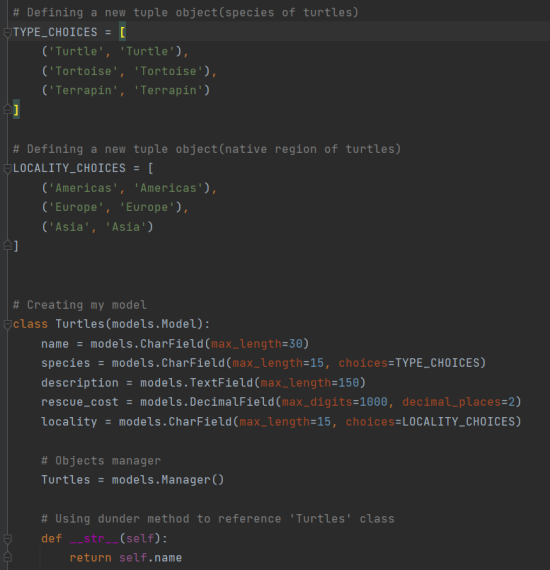
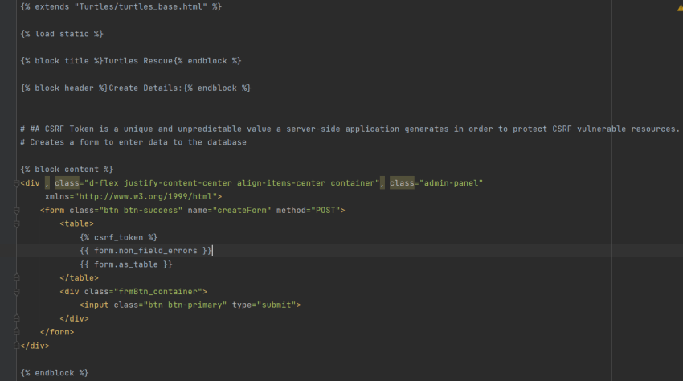
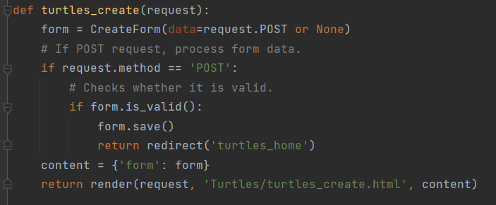
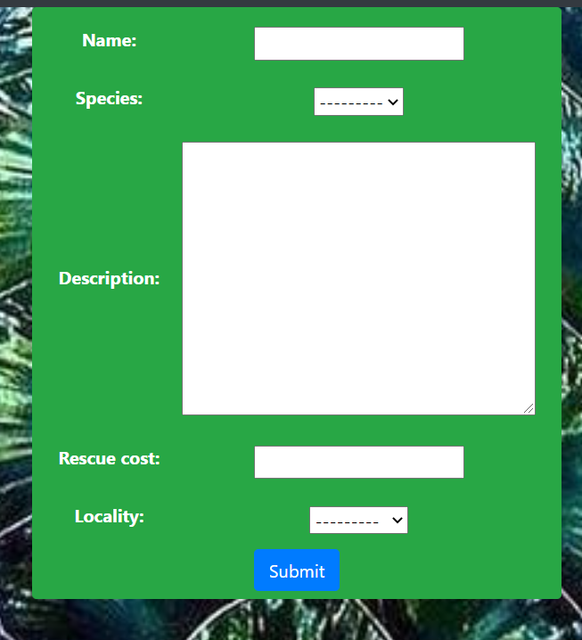

### Editing Items
Here I had to create a views template and function that would render a selected item from the database and be able to edit it.
 
 
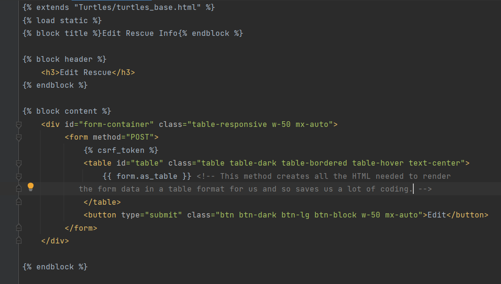
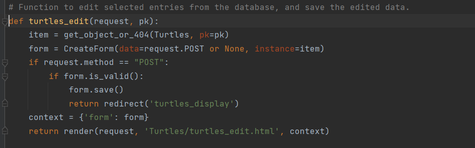
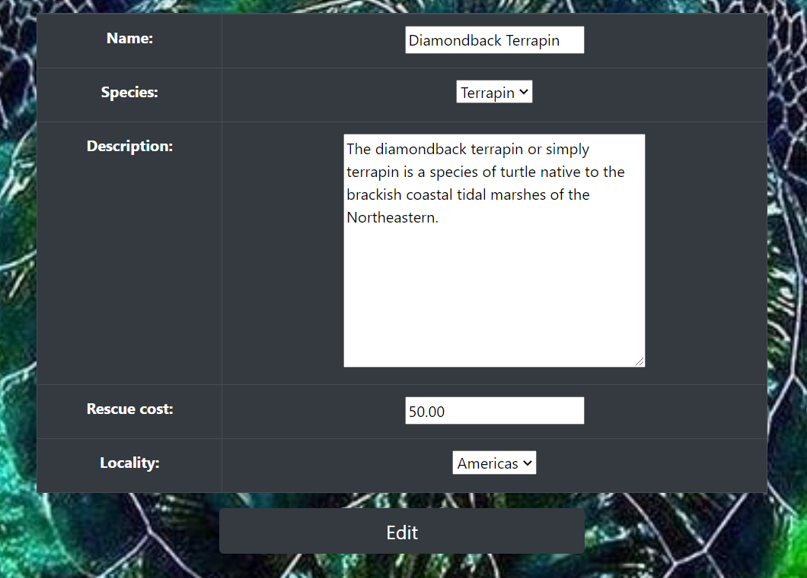
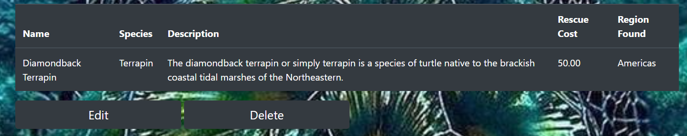

### Deleting Items
Next I added a delete template and views function to be able to delete a selected item from the database.
 
 
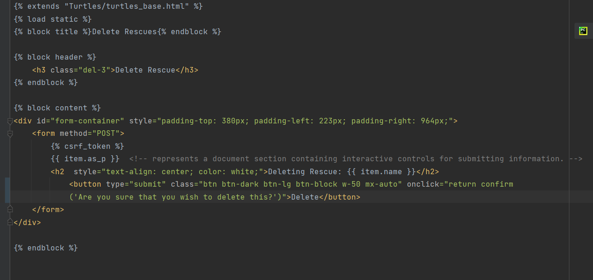
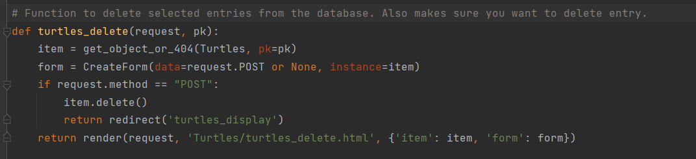
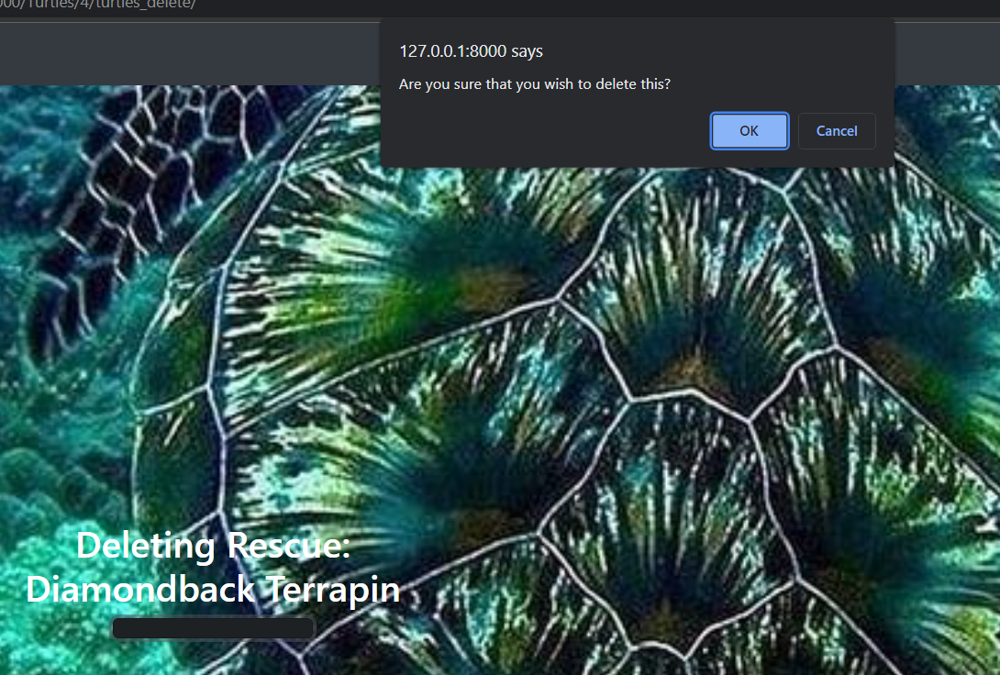

### Displaying Items
I also needed to create a template to display the items saved in the database. Also a views function to collect all items from the database and send them to my display template.
 
 
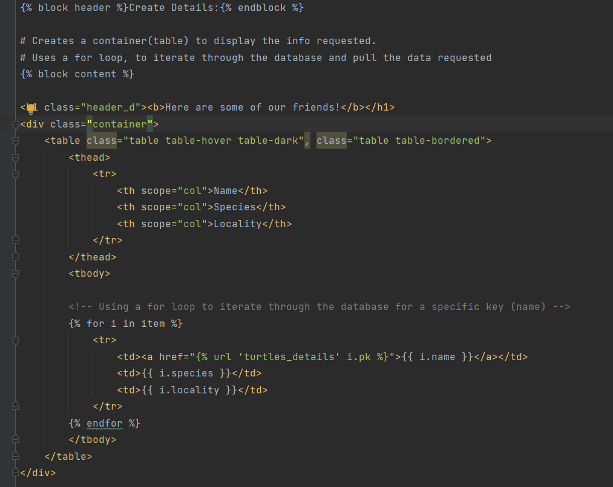
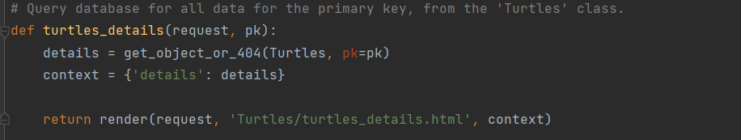
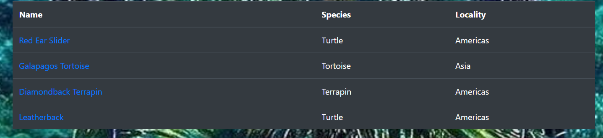

### Skills Learned
Some skills that I aquired through the Live Project:

* Working in a team enviroment
* Agile and Scrum methodologies
* Better understanding of Django
* How to utilize MTV design pattern
* Using version control to better manage everyones code for the project

### End Note
After completing this project, I definitely feel more confident in what knowledge I've learned through my boot camp, and there will be more to come for this project. I plan on adding more to with APIs, webscraping and getting a better understanding of applying bootstrap.